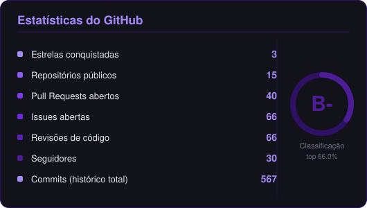
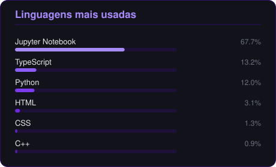
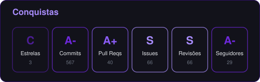

 

## Sobre mim

Estudante de **Engenharia de Software na UnB** e atual **Residente em Inteligência Artificial** pelo Instituto Eldorado em parceria com a UnB. Atuo na interseção entre tecnologia, dados e negócios: gosto de resolver problemas reais com código, unindo machine learning, análise de dados e boas práticas de engenharia de software. 

Minha vivência prática em **gestão de projetos (PMI, Scrum, Kanban)** atua como um diferencial na construção de soluções, permitindo-me ser a ponte entre stakeholders técnicos e de negócio, mapeando processos, elicitando requisitos e focando na entrega real de valor.

- 🤖 **Residente em IA** — Instituto Eldorado - UnB (2026), com carga prática em machine learning e análise de dados.
- 🎓 **Engenharia de Software** — UnB (2024–2028) · Monitor de *Métodos de Desenvolvimento de Software* e *Cálculo 1*.
- 🧭 **Project Manager (Voluntário)** — PMI Distrito Federal (PMI Student Club).
- 💻 **Desenvolvimento Full Stack** com Python, TypeScript, JavaScript e SQL.

 

## Stack técnica

## Metodologias & Gestão

 

## Métricas & Performance

<!-- Os dois cards acima são gerados automaticamente pelo workflow stats.yml e vivem dentro deste repositório — não dependem de nenhum serviço externo. -->

 

<picture>
  <source media="(prefers-color-scheme: dark)" srcset="https://raw.githubusercontent.com/gpaulovit/gpaulovit/output/github-contribution-grid-snake-dark.svg" />
  <source media="(prefers-color-scheme: light)" srcset="https://raw.githubusercontent.com/gpaulovit/gpaulovit/output/github-contribution-grid-snake.svg" />
  
</picture>

## Contato

 

